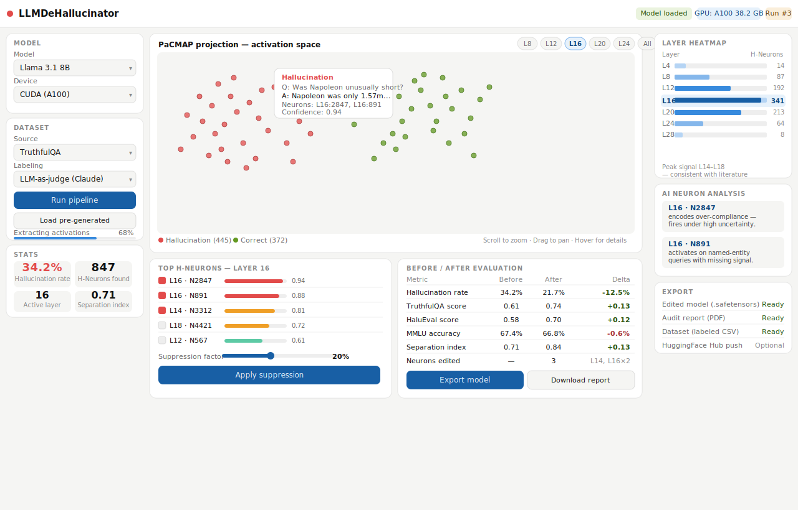

<!--
  SEO Metadata — LLMDeHallucinator
  ─────────────────────────────────────────────────────────────────────────────
  description: LLMDeHallucinator is an open-source Python research pipeline for
    automated detection, visualization, and surgical suppression of
    hallucination-associated neurons (H-Neurons) in large language models (LLMs).
    Built on mechanistic interpretability techniques using TransformerLens,
    PaCMAP, and sparse L1 probing, it provides a GUI-driven workflow for
    neuron-level model editing without retraining.

  keywords: LLM hallucination detection, mechanistic interpretability,
    H-Neurons, hallucination suppression, neuron weight editing, TransformerLens,
    LLM interpretability, sparse probing, PaCMAP visualization, activation
    extraction, CETT metric, TruthfulQA, HaluEval, TriviaQA, MMLU benchmark,
    large language model research, AI safety, model editing, feed-forward neurons,
    layer analysis, logistic regression probe, Llama 3.1, GPT-2, Mistral,
    open-source LLM, Plotly Dash, neural network interpretability, LLM alignment,
    hallucination mitigation, LLM-as-judge, safetensors, HuggingFace

  og:title: LLMDeHallucinator — Surgical Hallucination Suppression for Open-Source LLMs
  og:description: Interactive pipeline for finding and suppressing hallucination-associated
    neurons in LLMs using mechanistic interpretability. No retraining required.
  og:type: website

  twitter:card: summary_large_image
  twitter:title: LLMDeHallucinator — LLM Mechanistic Interpretability Research Tool
  twitter:description: Detect, visualize and surgically suppress hallucination neurons
    in open-source LLMs using TransformerLens, PaCMAP and sparse L1 probing.
-->

# LLMDeHallucinator

> **Automated detection, visualization and suppression of hallucination-associated neurons in open-source LLMs**

[](#roadmap)
[](https://www.python.org/)
[](https://dash.plotly.com/)
[](https://github.com/TransformerLensOrg/TransformerLens)
[](https://github.com/YingfanWang/PaCMAP)
[](https://arxiv.org/abs/2512.01797)
[](LICENSE)

> [!WARNING]
> **This project is actively under development.** The architecture and documentation are in place, but the implementation is ongoing. Expect breaking changes. Contributions and feedback are welcome — see the [Roadmap](#roadmap) for current status.



---

**Topics:**
`llm-hallucination` · `mechanistic-interpretability` · `h-neurons` · `hallucination-detection` · `hallucination-suppression` · `neuron-editing` · `transformerlens` · `pacmap` · `sparse-probing` · `cett-metric` · `activation-extraction` · `model-editing` · `ai-safety` · `llm-alignment` · `truthfulqa` · `halu-eval` · `mmlu` · `open-source-llm` · `llama` · `gpt2` · `plotly-dash` · `interpretability-research` · `weight-suppression` · `feed-forward-neurons`

---

## Research Background

### H-Neurons — Gao et al., arXiv:2512.01797 *(primary reference)*

The paper that directly motivates this project. Key findings:

- Fewer than **0.1% of neurons** reliably predict hallucination events across six LLMs (Mistral, Gemma, Llama families)
- H-Neurons concentrate in **middle layers** and originate during **pre-training** — instruction tuning leaves them largely untouched ("parameter inertia")
- Detection AUROC exceeds **86%** on Mistral family models using only 2 features per neuron
- Causal validation: amplifying H-Neuron activations increases hallucination and sycophancy rates; ablating them reduces them

**Their exact method:** Consistency filtering (10 samples per question, keep only always-correct / always-wrong), compute CETT scores per neuron, train L1 logistic regression on `[CETT_answer, CETT_other]`. That is the complete input feature set.

LLMDeHallucinator extends this with richer features (distribution comparison, weight statistics, LightGBM, Boruta) and adds the suppression + evaluation pipeline the paper stopped short of building.

---

### Inference-Time Intervention — Li et al., NeurIPS 2023

Found that truthfulness is **linearly encoded in attention head activations**. Key contribution: the **mass mean shift** — the vector from the centroid of false-response activations to the centroid of true-response activations — is a more reliable intervention direction than trained probe weights. Shifting activations along this direction at inference time (no weight editing) improves TruthfulQA scores by 13–42 percentage points depending on model.

*Relevance: confirms that correct vs. hallucinating distribution comparison is meaningful and causal. Informs our baseline distribution feature design.*

---

### Towards Monosemanticity — Bricken et al., Anthropic 2023

MLP neurons are **polysemantic** — one neuron fires for multiple unrelated concepts due to superposition. Sparse Autoencoders (SAEs) fix this: training a two-layer autoencoder with L1 sparsity on MLP activations (e.g. 512 neurons → 4096 features) recovers monosemantic features, ~70% of which are judged interpretable by human raters. Causal validation: steering a single SAE feature shifts model output in the predicted direction.

*Relevance: motivates SAE as the advanced detection mode. Raw neurons are noisy; SAE features give cleaner signal.*

---

### Do I Know This Entity? — Ferrando et al., ICLR 2025

Applied pre-trained SAEs (Gemma Scope) to the entity knowledge problem. Introduced the **separation score** per SAE latent:

```
score = fraction_fires_on_known − fraction_fires_on_unknown
```

Selected the latent that maximises this score across all entity types without any supervised training. Achieved AUROC 73.2 detecting hallucination. Causal steering of the identified latent induced near-100% refusal rate on unknown entities.

*Relevance: separation score is the unsupervised analogue of our Cohen's d feature. Confirms that distribution-level comparison between known and unknown responses is causally meaningful.*

---

### Key Hypothesis

> H-Neurons concentrated in layers 8–20 are sufficient for hallucination detection and suppression, with a MMLU accuracy delta below 2% at a 20% suppression factor.

This hypothesis is testable within the LLMDeHallucinator pipeline and represents a concrete contribution beyond the original H-Neurons paper, which stopped short of building a production suppression tool.

---

## Citation

If you use LLMDeHallucinator in your research, please cite the H-Neurons paper that motivated it:

```bibtex
@misc{gao2025hneurons,
  title={H-Neurons: On the Existence, Impact, and Origin of
         Hallucination-Associated Neurons in LLMs},
  author={Cheng Gao et al.},
  year={2025},
  eprint={2512.01797},
  archivePrefix={arXiv}
}
```

---

## Overview

LLMDeHallucinator is an interactive research pipeline built with Python and Plotly Dash that takes an open-source LLM as input and produces a de-hallucinated model as output — along with a full audit report detailing exactly which neurons were modified and by how much.

The pipeline is grounded in the **H-Neurons** research (Gao et al., 2025, arXiv:2512.01797), which demonstrated that fewer than 0.1% of neurons in a model reliably predict hallucination events. LLMDeHallucinator operationalizes this finding into an end-to-end, GUI-driven workflow accessible to any researcher — no custom scripts required.

```
model_in.safetensors
        │
        ▼
┌───────────────────────────────────────┐
│         LLMDeHallucinator             │
│                                       │
│  1. Generate hallucination dataset    │
│  2. Extract layer activations         │
│  3. Identify H-Neurons (ML/AI)        │
│  4. Visualize with PaCMAP             │
│  5. Suppress neuron weights           │
│  6. Evaluate before/after             │
│  7. Generate audit report             │
└───────────────────────────────────────┘
        │
        ▼
model_out.safetensors + report.pdf
```

---

## Motivation

Large language models hallucinate. Existing mitigation strategies — RAG, RLHF, prompt engineering — treat the symptom rather than the cause. Recent mechanistic interpretability research has shown that hallucination is not diffuse across the entire model; it is concentrated in a small, identifiable subset of feed-forward neurons that encode an **over-compliance bias**: the tendency to produce a confident-sounding answer even when the model has no reliable knowledge.

LLMDeHallucinator makes it possible to:

- **See** exactly where hallucinations live inside the model, layer by layer
- **Understand** which neurons are responsible and why, using AI-assisted classification
- **Fix** the problem by surgically reducing neuron weights rather than retraining
- **Verify** that the edit improved hallucination rates without degrading general capability

---

## Key Features

### Interactive Dash Application
- Load any HuggingFace-compatible model directly from the UI
- Choose between running a fresh hallucination dataset or loading a pre-generated one
- Real-time progress feedback during pipeline execution
- Full GPU/CPU support with automatic device detection

### Hallucination Dataset Generation
- Built-in support for **TruthfulQA**, **HaluEval**, and **TriviaQA**
- Automatic answer labeling via exact match and semantic similarity
- Optional **LLM-as-judge** mode using an external model (e.g. GPT-4o, Gemini) for richer, non-binary labeling beyond simple factual QA
- Export generated dataset for reuse across runs

### H-Neuron Detection
- **Three-tier detection pipeline** — fast baseline to frontier-grade analysis:
  - **L1 Logistic Regression** — sparse linear probe, fast, good for quick runs (baseline)
  - **LightGBM** — gradient-boosted trees, captures non-linear neuron interactions, built-in SHAP feature importance
  - **Sparse Autoencoders (SAE)** — frontier approach; decomposes polysemantic neurons into monosemantic features for the cleanest possible signal *(planned)*
- CETT metric (Contribution to Each Token's representation) for neuron activation quantification
- Focus on **middle layers (8–20)** where hallucination signal peaks — configurable
- Confidence scoring per neuron across all detection methods

### PaCMAP Visualization (2D and 3D)
- Interactive scatter plot — zoom, pan, hover, lasso-select
- Each point = one model response, colored by hallucination/correct
- Hover reveals: original prompt, model response, layer, contributing neurons
- Layer-by-layer animation to see how clusters form across the network
- Small-multiples view: all layers simultaneously in a grid
- Separation index per layer — quantifies cluster quality numerically

### Neuron Weight Suppression
- Select neurons for editing directly from the visualization or from the ranked list
- Configurable suppression factor (e.g. reduce weight by 10–50%)
- Iterative mode: suppress gradually and re-evaluate after each step
- Safety clamp: MMLU accuracy monitored in parallel — automatic stop if general capability degrades beyond threshold

### Before / After Evaluation
- Re-runs the full hallucination dataset on the edited model
- Side-by-side comparison: hallucination rate, separation index, PaCMAP overlay
- General capability benchmark (MMLU subset) before and after — ensures neurons edited did not damage the model
- Delta report: exactly what changed, how much, where

### Audit Report Generation
- Auto-generated PDF report per run
- Lists every edited neuron: layer, index, original weight, new weight, suppression factor
- Before/after metrics: TruthfulQA score, HaluEval score, MMLU delta
- PaCMAP visualizations embedded in report
- Reproducibility section: random seeds, model version, dataset used

---

## CETT — The Core Neuron Metric

**CETT (Contribution-based Efficacy Token Test)** is the metric introduced by the H-Neurons paper for measuring how much a single feedforward neuron contributes to the model's information flow at a specific token position.

For neuron `j` at token position `t`:

```
CETT(j, t) = ‖ z_t^(j) · W_out[j, :] ‖₂  /  ‖ h_t ‖₂
```

Where:
- `z_t^(j)` — the post-activation scalar value of neuron `j` at token `t` (after GELU/ReLU)
- `W_out[j, :]` — the `j`-th row of the MLP down-projection matrix (neuron `j`'s "write vector" into the residual stream)
- `z_t^(j) · W_out[j, :]` — the rank-1 vector that neuron `j` contributes to the hidden state
- `h_t` — the full MLP output at token `t`

The ratio is a number between 0 and 1 expressing what **fraction of the total MLP output magnitude** at token `t` is attributable to neuron `j` alone.

### Why CETT over raw activations

Raw activation values (`z_t^(j)`) are not comparable across neurons — a neuron with small activations but large output weights can dominate the residual stream, while a neuron with large activations but tiny output weights may be irrelevant. CETT accounts for both, making it a true measure of influence rather than mere activity.

### The two CETT features per neuron (H-Neurons paper)

The paper aggregates CETT into exactly two features per neuron:

| Feature | Description |
|---|---|
| `CETT_answer` | Mean CETT across the **answer token span** — where hallucination happens |
| `CETT_other` | Mean CETT across all **non-answer tokens** — the baseline contribution |

A neuron with high `CETT_answer` and low `CETT_other` is specifically active during answer generation — a strong hallucination signal.

### Computing CETT with TransformerLens

TransformerLens exposes everything needed natively — no additional libraries required:

```python
# Hook into per-neuron post-activation values
z = model.hook("blocks.{layer}.mlp.hook_post")  # [batch, seq, d_mlp]

# Get the down-projection write vectors
W_out = model.W_out[layer]                       # [d_mlp, d_model]

# Compute neuron j's rank-1 contribution at token t
contribution = z[0, t, j] * W_out[j, :]         # [d_model]

# CETT for neuron j at token t
cett = contribution.norm() / h_t.norm()          # scalar
```

`W_out` norms can be precomputed once per model — making CETT efficient to compute across thousands of neurons and prompts.

---

## Feature Engineering — What Goes Into Detection

CETT is the primary signal. The pipeline extends it by running the dataset in two passes — once on **correct (non-hallucinating) prompts** to build a per-neuron CETT baseline, once on **hallucinating prompts** to measure the deviation. This dual-pass approach is what makes the features meaningful rather than just large numbers.

### Training Data Construction — Consistency Filtering
Following the H-Neurons paper: for each question, **10 responses are sampled** at non-zero temperature. Only the extremes are kept:
- **Always correct** — all 10 responses right
- **Always wrong** — all 10 responses wrong (confirmed hallucination, not refusal)

This removes ambiguous middle-ground examples and produces clean binary labels.

### Baseline Statistics — Correct Prompts
Computed per neuron across all consistently-correct responses:

| Feature | Description |
|---|---|
| `cett_answer_correct` | Mean CETT over **answer tokens** during correct responses — the clean baseline |
| `cett_other_correct` | Mean CETT over **non-answer tokens** during correct responses |
| `cett_std_correct` | Spread of CETT values — how stable is this neuron on correct responses? |
| `cett_p95_correct` | 95th percentile CETT — upper bound of normal behavior |

### Hallucination Statistics — Hallucinating Prompts
Computed per neuron across all consistently-wrong responses:

| Feature | Description |
|---|---|
| `cett_answer_halluc` | Mean CETT over **answer tokens** during hallucinations — the key signal |
| `cett_other_halluc` | Mean CETT over **non-answer tokens** during hallucinations |
| `cett_std_halluc` | Spread during hallucinations |
| `cett_p95_halluc` | 95th percentile CETT during hallucinations |

### Contrast Features — The Signal
Derived by comparing the two CETT distributions:

| Feature | Description |
|---|---|
| `cett_answer_delta` | `cett_answer_halluc − cett_answer_correct` — lift on answer tokens during hallucination |
| `cett_specificity` | `cett_answer_halluc / cett_other_halluc` — does this neuron spike specifically on answers? |
| `cohen_d` | Effect size between correct and hallucination CETT distributions |
| `separation_score` | `fraction_fires_halluc − fraction_fires_correct` — Ferrando-style separation |
| `kl_divergence` | How different are the two CETT distributions overall? |

### Static Neuron Features — Structural Properties
Fixed per neuron, independent of any prompt:

| Feature | Description |
|---|---|
| `w_out_norm` | L2 norm of `W_out[j, :]` — how large is this neuron's write vector? |
| `weight_rank_in_layer` | Rank of `w_out_norm` among all neurons in the same layer |
| `weight_zscore_in_layer` | Z-score of `w_out_norm` within the layer — outlier neurons are suspicious |
| `layer_index` | Which layer this neuron belongs to |
| `layer_relative_position` | `layer / total_layers` — position in network (0 = early, 1 = late) |

### Why Both Distributions Matter

> A neuron with `cett_answer_halluc = 0.031` is unremarkable if its `cett_answer_correct = 0.029`. The same score when `cett_answer_correct = 0.003` represents a 10× lift on answer tokens — that is an H-Neuron.

Boruta uses these features to reject neurons with no discriminative power before LightGBM sees them. LightGBM then learns interaction patterns — e.g. high `cohen_d` AND high `weight_rank_in_layer` AND high `cett_specificity` — that the original L1 probe on 2 features alone cannot capture.

---

## AI + Human — Not a Black Box

LLMDeHallucinator is designed as a **collaborative tool**, not a fully automated pipeline. The L1 probe detects H-Neurons at scale; the researcher stays in control.

The automatic detector finds neurons that statistically predict hallucination. The PaCMAP visualization reveals the geometry — and geometry often tells you what statistics miss. A neuron with a confidence score of 0.61 might fire precisely on a tight sub-cluster of hallucination points that the top-ranked neuron never touches. Only a human looking at the visualization catches that.

```
Auto-detected neurons (L1 probe)
         +
Researcher inspects PaCMAP clusters
         +
Lasso-select → "which neurons fire here?"
         +
Manual add / remove candidates
         +
Re-run suppression with curated selection
```

This is **human-in-the-loop mechanistic interpretability** — ML detection at scale, human pattern recognition where it matters. The researcher can question the probe, catch false positives, and build genuine understanding of why specific neurons matter. Neither alone is as good as both together.

---

## Architecture

```
LLMDeHallucinator/
│
├── app.py                    # Dash entry point
│
├── pipeline/
│   ├── loader.py             # Model loading (HuggingFace + TransformerLens)
│   ├── dataset.py            # TruthfulQA / HaluEval / TriviaQA loading and labeling
│   ├── activations.py        # TransformerLens activation extraction
│   ├── detection.py          # H-Neuron identification (L1 probe + CETT)
│   ├── judge.py              # Optional LLM-as-judge labeling
│   ├── suppression.py        # Weight editing and model export
│   └── evaluation.py         # Before/after benchmark runner
│
├── visualization/
│   ├── pacmap_view.py        # PaCMAP projection + Plotly scatter
│   ├── layer_grid.py         # Small-multiples layer view
│   └── neuron_inspector.py   # Ranked neuron list with activation heatmap
│
├── report/
│   └── generator.py          # PDF report generation
│
├── ui/
│   ├── layout.py             # Dash layout definition
│   └── callbacks.py          # All Dash callbacks
│
├── notebooks/
│   └── colab_quickstart.ipynb  # Google Colab notebook for GPU runs
│
├── data/
│   └── pregenerated/         # Pre-labeled hallucination datasets
│
├── cache/
│   └── {model_id}/           # Top-level directory per model (e.g. llama-3.1-8b)
│       └── {session_id}/     # One sub-directory per run (dataset + date)
│           ├── session.json      # Session metadata: model, dataset, config, timestamps
│       ├── dataset.parquet       # Labeled prompts and responses (correct / hallucinating)
│       ├── cett/
│       │   ├── correct.h5        # CETT scores — correct prompts  [n_neurons × n_correct]
│       │   └── halluc.h5         # CETT scores — hallucinating prompts [n_neurons × n_halluc]
│       ├── features.parquet      # Full feature set per neuron (all contrast + static features)
│       ├── detection/
│       │   ├── boruta.json       # Boruta confirmed / rejected neuron lists
│       │   ├── lightgbm.json     # LightGBM scores + SHAP values per neuron
│       │   └── rankings.parquet  # Final ranked neuron list with all scores
│       ├── pacmap/
│       │   ├── coords_2d.npy     # PaCMAP 2D projection coordinates
│       │   └── coords_3d.npy     # PaCMAP 3D projection coordinates
│       ├── h_neurons.json        # H-Neuron selection state (see below)
│       └── evaluation/
│           ├── before.json       # Pre-suppression benchmark metrics
│           └── after.json        # Post-suppression benchmark metrics
│
├── tests/
│   └── test_pipeline.py      # Unit tests (GPT-2 Small, CPU)
│
└── requirements.txt
```

---

## Session & Cache Management

Computing CETT scores across thousands of neurons and hundreds of prompts is expensive. Running it every time a researcher adjusts the suppression factor or tweaks the neuron selection would make the tool unusable. Every computed artifact is therefore persisted to disk under `cache/{session_id}/` and reloaded on subsequent runs — no recomputation unless the source data or model changes.

### What is cached and when

| Artifact | File | Computed once when |
|---|---|---|
| Labeled dataset (correct / halluc prompts) | `dataset.parquet` | Dataset step completes |
| CETT scores — correct prompts | `cett/correct.h5` | Activation extraction completes |
| CETT scores — hallucinating prompts | `cett/halluc.h5` | Activation extraction completes |
| Full feature set per neuron | `features.parquet` | Feature engineering completes |
| Boruta results | `detection/boruta.json` | Boruta run completes |
| LightGBM scores + SHAP values | `detection/lightgbm.json` | LightGBM run completes |
| Ranked neuron list | `detection/rankings.parquet` | Detection completes |
| PaCMAP 2D / 3D coordinates | `pacmap/coords_2d.npy` | PaCMAP projection completes |
| H-Neuron selection state | `h_neurons.json` | Updated on every change |
| Evaluation results | `evaluation/before.json` / `after.json` | Evaluation runs complete |

On startup the UI shows which cache artifacts already exist for the current session and skips straight to the first uncompleted step.

### H-Neuron selection state — `h_neurons.json`

This file tracks the full history of the neuron selection, including manual researcher overrides:

```json
{
  "session_id": "llama-3.1-8b_2025-01-15",
  "model": "meta-llama/Llama-3.1-8B",
  "auto_detected": [
    {"layer": 12, "neuron": 847, "score": 0.94, "cohen_d": 3.21}
  ],
  "manually_added": [
    {"layer": 12, "neuron": 1203, "score": 0.61, "reason": "fires on halluc sub-cluster in PaCMAP"}
  ],
  "manually_removed": [
    {"layer": 15, "neuron": 302, "score": 0.88, "reason": "false positive — fires on code tokens"}
  ],
  "final_selection": [847, 1203, ...],
  "suppression_factors": {
    "12_847": 0.20,
    "12_1203": 0.15
  },
  "last_modified": "2025-01-15T14:23:11Z"
}
```

Every manual add, remove, and suppression factor change is written immediately. The researcher can undo any change, reload a previous selection state, or export the selection for use in a different session.

### Cache structure — per model, per session

```
cache/
├── llama-3.1-8b/
│   ├── truthfulqa_2025-01-15/    ← session 1
│   └── halu-eval_2025-01-22/     ← session 2 (different dataset, same model)
├── mistral-7b/
│   └── truthfulqa_2025-01-18/
└── gpt2/
    └── truthfulqa_2025-01-10/    ← dev run
```

CETT scores computed for a given model are stored under that model's directory and **reused across sessions** that use the same model — even with a different dataset. This means if you run TruthfulQA and then HaluEval on the same model, the `w_out_norm` and weight statistics are computed only once. Only the prompt-level CETT scores (which depend on the dataset) are recomputed.

### Cache invalidation rules

| What changed | What is invalidated | What is reused |
|---|---|---|
| Different model | Everything | Nothing |
| Same model, different dataset | Dataset, CETT scores, features, detection, PaCMAP | Weight statistics (`w_out_norm`, ranks) |
| Same model + dataset, different detection params | Detection results, PaCMAP, evaluation | CETT scores, features |
| Suppression factor changed | Evaluation only | Everything upstream |
| Neuron selection changed | Evaluation only | Everything upstream |

### Storage format rationale

| Format | Used for | Why |
|---|---|---|
| HDF5 (`.h5`) | CETT score matrices | Efficient columnar access to large float arrays; supports partial reads by neuron or by prompt |
| Parquet | Tabular data (dataset, features, rankings) | Columnar, compressed, fast pandas load |
| NumPy (`.npy`) | PaCMAP coordinates | Simple, fast, small |
| JSON | Selection state, detection results, evaluation metrics | Human-readable, easy to inspect and version |

---

## Installation

```bash
git clone https://github.com/YOUR_USERNAME/LLMDeHallucinator.git
cd LLMDeHallucinator
pip install -r requirements.txt
python app.py
# Open http://localhost:8050 in your browser
```

### Requirements

```
dash>=2.14
plotly>=5.18
transformer-lens>=2.0
pacmap>=0.7
torch>=2.1
transformers>=4.40
datasets>=2.18
scikit-learn>=1.4
pandas>=2.0
numpy>=1.26
reportlab>=4.0       # PDF report generation
```

---

## Quickstart

### Local development (CPU, GPT-2 Small)

```python
# GPT-2 Small (117M) runs on CPU in seconds — perfect for development
# Switch to Llama 3.1 8B on GPU for real research runs

python app.py --model gpt2 --device cpu
```

### Google Colab (A100 GPU, Llama 3.1 8B)

Open `notebooks/colab_quickstart.ipynb` in Google Colab.  
Select **Runtime → Change runtime type → A100 GPU**.  
Run all cells — the Dash app exposes itself via an ngrok tunnel.

### Vast.ai / RunPod (recommended for iterative research)

```bash
# ~$0.30/h on RTX 4090, ~$1.00/h on A100
# Clone repo, pip install, run app.py
# Saves model_out.safetensors to /outputs for download
```

---

## Workflow Walkthrough

### Step 1 — Load Model
Select a model from the dropdown (GPT-2, Llama 3.1 8B, Mistral 7B, Phi-3 Mini, or any HuggingFace path). GPU memory requirement is shown automatically.

**As soon as a model is selected, the UI checks `cache/{model_id}/` for existing sessions.** If previous runs exist, they are listed with their dataset, date, and completed steps. The researcher can resume any prior session — jumping directly to the first incomplete step — or start a fresh run. No recomputation of already-cached artifacts.

```
Model selected: Llama 3.1 8B
  ┌─────────────────────────────────────────────┐
  │ Existing sessions found:                    │
  │                                             │
  │ ● truthfulqa_2025-01-15   [complete]        │
  │   → Resume: go to suppression / export      │
  │                                             │
  │ ● halu-eval_2025-01-22    [CETT cached]     │
  │   → Resume: start from detection step       │
  │                                             │
  │ + Start new session                         │
  └─────────────────────────────────────────────┘
```

### Step 2 — Prepare Dataset
Choose a pre-packaged dataset (TruthfulQA, HaluEval, TriviaQA) or upload your own CSV. Optionally enable **LLM-as-judge** mode for richer labeling — recommended for non-factual hallucination detection. If a cached dataset exists for this model + dataset combination, it is loaded instantly.

### Step 3 — Run Activation Extraction & CETT
The pipeline runs the dataset through the model via TransformerLens, extracts per-neuron post-activation values, and computes CETT scores for every neuron across correct and hallucinating prompts. Results are written to `cett/correct.h5` and `cett/halluc.h5` immediately. On any subsequent run this step is skipped entirely and the cached HDF5 files are loaded directly.

### Step 4 — H-Neuron Detection
Choose your detection mode: **L1 probe** (fast baseline), **LightGBM + SHAP** (non-linear, captures neuron interactions), or **SAE** (frontier, monosemantic feature decomposition — planned). Boruta runs first to eliminate uninformative neurons. Results are cached in `detection/`. Changing detection parameters re-runs only this step — CETT scores upstream are untouched.

### Step 5 — PaCMAP Visualization
The CETT activation space is projected to 2D or 3D with PaCMAP. Hallucination responses cluster separately from correct responses — most clearly in middle layers 8–20. Projections are cached in `pacmap/` and reloaded instantly on revisit. Use the layer slider to animate through the network and observe cluster formation.

### Step 6 — Select Neurons for Suppression
Neurons are pre-selected based on detection confidence. Review and adjust in the neuron inspector — manually add or remove neurons via the ranked list or by lasso-selecting PaCMAP clusters. Every change is saved immediately to `h_neurons.json`, including the reason for manual overrides. The full history of additions and removals is preserved and reversible.

### Step 7 — Suppress Weights
Set suppression factor per neuron (recommended: start at 20%). Click **Apply**. The model weights are edited in memory. Suppression factors are saved to `h_neurons.json`.

### Step 8 — Before / After Evaluation
The dataset is re-run on the edited model. PaCMAP overlay shows the shift in cluster separation. Hallucination rate and MMLU delta are displayed side by side. Results saved to `evaluation/before.json` and `evaluation/after.json`. Adjusting only the suppression factor and re-evaluating reuses all upstream cache — only the evaluation step reruns.

### Step 9 — Export
Save the edited model as `.safetensors`. Download the PDF audit report. Optionally push to HuggingFace Hub.

---

## Limitations and Known Challenges

**Labeling quality**  
Simple exact-match labeling against TriviaQA/TruthfulQA only captures factual hallucinations. LLM-as-judge mode extends coverage but adds latency and cost. Non-factual hallucinations (false reasoning, confabulation) remain harder to label automatically.

**Suppression trade-off**  
The original H-Neurons paper notes that simple weight suppression can reduce model helpfulness. LLMDeHallucinator mitigates this with gradual iterative suppression and MMLU monitoring, but the fundamental tension between compliance and truthfulness is an open research problem.

**Model coverage**  
Tested on GPT-2 (development) and Llama 3.1 8B (primary target). H-Neuron patterns may differ across architectures. Contributions testing on Mistral, Phi, Gemma welcome.

**GPU requirement**  
Models above 3B parameters require a GPU with 16GB+ VRAM for comfortable use. Google Colab Pro (A100) or Vast.ai are recommended for 7B/8B models.

---

## Roadmap

- [x] Project architecture design
- [ ] Core pipeline (TransformerLens + TruthfulQA + L1 probe baseline)
- [ ] LightGBM detection mode with SHAP neuron importance
- [ ] Dash UI skeleton with model loader
- [ ] PaCMAP visualization with hover/zoom and manual lasso selection
- [ ] Neuron weight suppression and model export
- [ ] Before/after evaluation with MMLU
- [ ] PDF report generation
- [ ] LLM-as-judge labeling mode
- [ ] 3D PaCMAP view
- [ ] Small-multiples layer grid
- [ ] Google Colab quickstart notebook
- [ ] HuggingFace Hub integration
- [ ] Support for Mistral, Phi-3, Gemma
- [ ] SAE-based detection (monosemantic feature decomposition)

---

## Contributing

Contributions welcome. This is an early-stage research project — the most valuable contributions right now are:

1. Testing the pipeline on models other than GPT-2 and Llama 3.1 8B
2. Improving the LLM-as-judge labeling pipeline
3. Experimenting with alternative suppression strategies (e.g. LoRA-based rather than direct weight editing)
4. Adding new benchmark datasets

Please open an issue before starting significant work.

---

## License

MIT License. See [LICENSE](LICENSE) for details.

---

*Built with Python, Dash, TransformerLens, PaCMAP, and a genuine interest in making LLMs more honest.*
